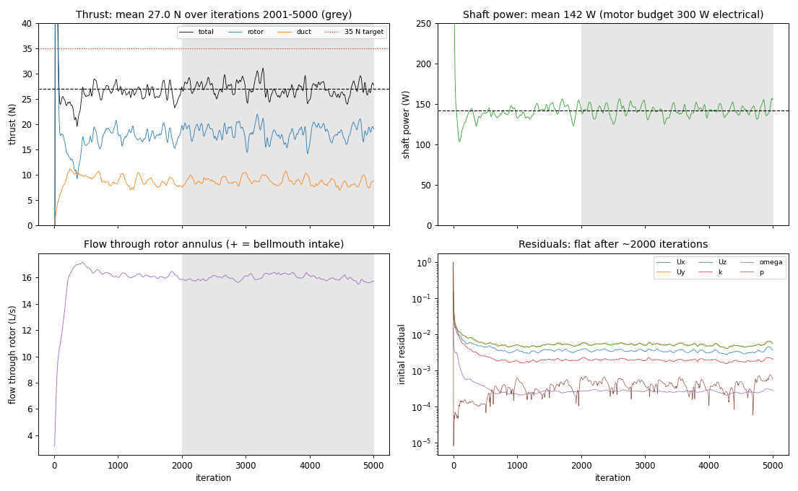
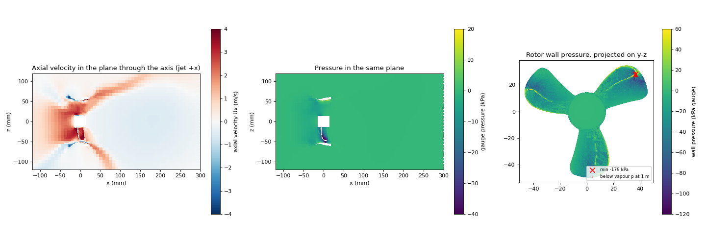

# Prototype 1B-14 L0 baseline

Steady MRF, k-omega SST, bollard (still water), seawater, 3000 rpm. Generated by `scripts/convergence_report.py`.

## Mesh and geometry

- Cells 1893009; max non-orthogonality 66.676815; max skewness 3.422999; checkMesh Mesh OK
- Rotor STL sha256 `4f4c740a5d4f183b1d134d914603ec67044e5e2d9e0b24bf64fbba3ce15b5c28`; see geometry/GEOMETRY_REPORT.md

## Result

```
Iterations: 5000; omega +314.159 rad/s; averages over the last 3000 iterations (6 batches of 500)

  Quantity                                 Mean   95% +/-    (%)  drift %  window change %  peak-to-peak %
  Thrust, total (N)                       27.03     0.452   1.67     0.86             0.23           20.96
  Thrust, rotor (N)                       18.38     0.528   2.87     1.22
  Thrust, duct (N)                        8.649     0.366   4.23     5.28
  Rotor torque (N m)                     0.4511     0.006   1.33     0.45             0.86           18.17
  Shaft power (W)                         141.7      1.88   1.33     0.45
  Thrust / power (N/W)                    0.191   0.00376   1.97     1.32
  Flow through rotor (L/s)                15.99     0.164   1.03     0.79             0.86            4.46
  Min wall pressure, rotor (kPa)         -141.3      5.58   3.95     2.75
  Min wall pressure, duct (kPa)          -59.99      1.08   1.79     1.85

  residual Ux      final 3.69e-03  dropped 2.4 decades  change over last window 0.03 decades
  residual Uy      final 5.51e-03  dropped 2.2 decades  change over last window 0.04 decades
  residual Uz      final 5.76e-03  dropped 2.2 decades  change over last window 0.03 decades
  residual k       final 2.03e-03  dropped 2.7 decades  change over last window 0.03 decades
  residual omega   final 2.88e-04  dropped 1.7 decades  change over last window 0.03 decades
  residual p       final 5.58e-04  dropped 3.2 decades  change over last window 0.14 decades
  Cavitation, rotor: mean min wall pressure -141.3 kPa gauge (worst -184.5); absolute at 1.0 m depth -29.9 kPa vs vapour 2.34 kPa; needs > 4.2 m depth
  Cavitation, duct: mean min wall pressure -60.0 kPa gauge (worst -72.3); absolute at 1.0 m depth 51.4 kPa vs vapour 2.34 kPa; clear
  y+ rotor  min 1.49  max 157.1  mean 34.7
  y+ duct   min 0.21  max 325.6  mean 48.4
  Flow direction: bellmouth intake, jet leaves through the diffuser (+x) - as designed

VERDICT: NOT CONVERGED
```

## Interpretation (added 2026-09-14)



**Status: statistically steady in the integrated quantities, not converged.**

The steady MRF solution never settles. Thrust keeps oscillating by about ±10% about its mean, with periods of 300–1000 iterations, and the residuals have been flat at 10⁻³–10⁻⁴ since about iteration 2000.

The averages are nonetheless stable:
- thrust, torque and flow averaged over iterations 2001–5000 are each known to within ±1.0–1.7% (95%);
- averages over the last 1000, 2000 and 3000 iterations agree to within 1%.

The only statistical check that fails is the pressure residual, which is spiky and moved 0.14 decades against a 0.1 limit.

| Quantity (iterations 2001–5000) | Value |
|---|---|
| Thrust, total | 27.0 ± 0.45 N (target 35 N) |
| Thrust, rotor / duct | 18.4 ± 0.5 N / 8.6 ± 0.4 N |
| Rotor torque | 0.451 ± 0.006 N·m |
| Shaft power | 142 ± 2 W (motor budget 300 W electrical) |
| Thrust / power | 0.191 ± 0.004 N/W |
| Flow through rotor | 16.0 ± 0.2 L/s, bellmouth intake as designed |



### What the fields show

- **Cavitation:** mean lowest rotor wall pressure is −141 kPa gauge. At 1 m depth, 5.3 mm² of the rotor (0.05% of its area) falls below vapour pressure, on the aft side of the loop apex (r ≈ 46 mm, stations 53–67). The patch disappears below about 4.2 m depth. At L0 with wall functions this suction peak is only indicative.
- **Jet:** water leaves the duct as a spreading hollow cone at about 40°. The flow reverses along the axis downstream, reaching −0.6 m/s at x = 200 mm. Swirl behind the rotor reaches 13 m/s.
- **Wall y+:** rotor mean 35 (max 157), duct mean 48. That is the wall-function range, as expected at L0.

### Known limitations of this baseline

1. **Wake under-resolved.** Refinement stops at x = 18 mm, and the wake behind it sits in 8 mm cells. Mean swirl drops from 2.7 m/s to 0.4 m/s between x = 20 and 40 mm, far faster than angular momentum should decay, so the hollow-cone jet and the reversed axis flow are probably partly numerical.
2. **Domain small for a bollard jet.** The box is 2D upstream, 4D downstream and 2D in radius, against the 5D / 10D / 5D in PROTOTYPE1B_DESIGN.md. About 50–56 L/s crosses the side farfield in each direction, against 16 L/s through the rotor, so the spreading jet leaves through the sides of the box.
3. **Steady MRF oscillation.** A steady rotating-frame solution cannot capture blade-passing unsteadiness. The ± values above are the uncertainty of the average, not the force ripple.
4. **Single mesh level.** No mesh-independence check yet.

Quantities at the rotor (torque, blade pressure) are less exposed to limitations 1 and 2 than the jet and wake. Treat thrust, duct thrust and T/P as provisional.

### Recommended next step

Before comparing DOE cases or judging the 35 N target:
- enlarge the domain to the design-doc size;
- add a wake refinement region (a cylinder about 60 mm in radius from x = −50 to +200 mm);
- rerun, then compare against this baseline.

Expect a mesh of about 3 M cells and a run of 6–8 hours on this laptop.
